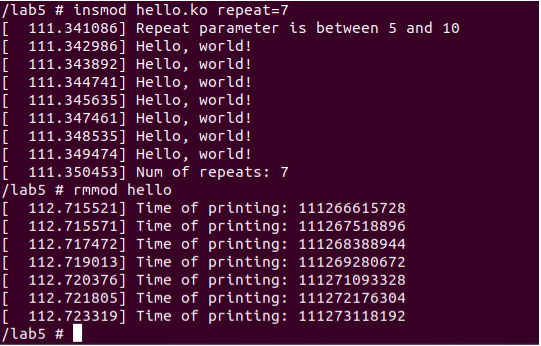

CA-Lab6

# hello.c

```
#include <linux/init.h>
#include <linux/module.h>
#include <linux/moduleparam.h>
#include <linux/printk.h>
#include <linux/types.h>
#include <linux/ktime.h>
#include <linux/slab.h>

struct head_list {
	struct head_list *next;
	ktime_t start_time;
};

MODULE_AUTHOR("Daniil Trotsenko");
MODULE_DESCRIPTION("Hello world printing Linux module");
MODULE_LICENSE("Dual BSD/GPL");

static struct head_list *head;

static int repeat = 1;
module_param(repeat, uint, S_IRUGO);
MODULE_PARM_DESC(times, "num of repeats");

static int __init hello_init(void)
{
	uint i = 0;
	struct head_list *this_var, *next_var;
	if(repeat == 0){
		printk(KERN_WARNING "Repeat parameter equals 0 \n");
	}
	else if(repeat >=5 && repeat <= 10){
		printk(KERN_WARNING "Repeat parameter is between 5 and 10 \n");
	}
	else if (repeat > 10){
		printk(KERN_ERR "Repeat parameter is bigger than 10 \n");
		return -EINVAL;
	}
	else if(repeat < 0){
		printk(KERN_ERR "Repeat parameter is negative \n");
		return -EINVAL;
	}

	head = kmalloc(sizeof(struct head_list), GFP_KERNEL);
	this_var = head;

	for(i = 0; i < repeat; i++){
	this_var->next = kmalloc(sizeof(struct head_list), GFP_KERNEL);
	this_var->start_time = ktime_get();
	pr_info("Hello, world!\n");
	next_var = this_var;
	this_var = this_var->next;
	}

	pr_info("Num of repeats: %d\n", repeat);
	kfree(next_var->next);
	next_var->next = NULL;
	
	return 0;
}

static void __exit hello_exit(void)
{
	struct head_list *tmp_var;
	while(head != NULL && repeat != 0){
		tmp_var = head;
		pr_info("Time of printing: %lld", tmp_var->start_time);
		head = tmp_var->next;
		kfree(tmp_var);
	}
	pr_info("");
}

module_init(hello_init);
module_exit(hello_exit);	
```

# Makefile

```
ifneq ($(KERNELRELEASE),)
# kbuild part of makefile
obj-m := hello.o
else
# normal makefile
KDIR ?= /lib/modules/`uname -r`/build

default:
	$(MAKE) -C $(KDIR) M=$$PWD
clean:
	$(MAKE) -C $(KDIR) M=$$PWD clean
endif
```


