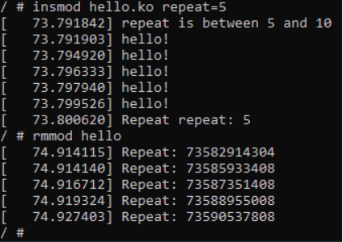

CA-Lab7

# hello.c

```#include <linux/init.h>
#include <linux/module.h>
#include <linux/moduleparam.h>
#include <linux/printk.h>
#include <linux/types.h>
#include <linux/slab.h>
#include <linux/ktime.h>

struct head_list {
  struct head_list *next;
  ktime_t time;
};

MODULE_AUTHOR("Berezhniuk Andrew");
MODULE_DESCRIPTION("Lab7");
MODULE_LICENSE("Dual BSD/GPL");

static struct head_list *head;

static uint repeat = 1;
module_param(repeat,uint,S_IRUGO);
MODULE_PARM_DESC(repeat, "Repeat amount of printing hello world");

static int __init init(void)
{
  uint i = 0;
  struct head_list *var_1, *var_2, *m, *var;

  head = kmalloc(sizeof(struct head_list *), GFP_KERNEL);

  var_1 = head;


  if(repeat == 0) {
    pr_warn("repeat = 0");
  }else if(repeat >=5 && repeat <= 10) {
    pr_warn("repeat is between 5 and 10");
  }
  BUG_ON(repeat>10);

  for(i = 0; i < repeat; i++){
    m = kmalloc(sizeof(struct head_list), GFP_KERNEL);
    if (i == 8){
        m = NULL;
    }
    if (ZERO_OR_NULL_PTR(m)){
        pr_err("test debug output");
        while (head != NULL && repeat != 0) {
            var = head;
            head = var->next;
            kfree(var);
        }
        BUG_ON(!m);
        return -ENOMEM;
    }
    var_1->time = ktime_get();
    pr_info("hello!");
    var_2 = var_1;
    var_1 = m;
  }
  if (repeat != 0) {
    kfree(var_2->next);
    var_2->next = NULL;
  }
  pr_info("Repeat repeat: %d\n", repeat);
  return 0;
}

static void __exit exit(void)
{
  struct head_list *var;

  while (head != NULL && repeat != 0) {
    var = head;
    pr_info("Repeat: %lld", var->time);
    head = var->next;
    kfree(var);
  }
  pr_info("");
}


module_init(init);
module_exit(exit);
```

# Makefile

```ifneq ($(KERNELRELEASE),)
# kbuild part of makefile
obj-m := hello.o
ccflags-y += -g
else
# normal makefile
KDIR ?= /lib/modules/`uname -r`/build

default:
	$(MAKE) -C $(KDIR) M=$$PWD
	cp hello.ko hello.ko.unstripped
	$(CROSS_COMPILE)strip -g hello.ko
clean:
	$(MAKE) -C $(KDIR) M=$$PWD clean
%.s %.i: %.c
	$(MAKE) -C $(KDIR) M=$$PWD $@
endif
```


